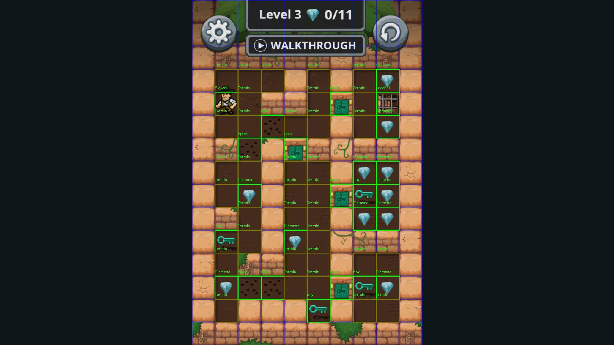

# Diamond Rush Bot

[](https://www.python.org/downloads/)
[](LICENSE)
[](#status)

An intelligent automated bot for playing **Diamond Rush** from the [Minijuegos](https://www.minijuegos.com) gaming platform. This project combines **computer vision** for real-time game perception with **AI-powered decision making** to autonomously solve Diamond Rush puzzles.

## 📋 Table of Contents

- [Overview](#overview)
- [Features](#features)
- [Architecture](#architecture)
- [Requirements](#requirements)
- [Installation](#installation)
- [Usage](#usage)
- [Demo](#demo)
- [How It Works](#how-it-works)
- [Limitations](#limitations)
- [Project Structure](#project-structure)
- [Contributing](#contributing)

## 🎮 Overview

Diamond Rush Bot autonomously plays Diamond Rush puzzle games by:

1. **Capturing** the game screen in real-time
2. **Analyzing** the game state using computer vision (object detection, grid mapping)
3. **Planning** optimal action sequences using A* pathfinding
4. **Simulating** game mechanics to find winning states
5. **Executing** commands via keyboard input automation

The bot is designed for the standard web version of Diamond Rush and works by intelligently prioritizing objectives (collecting diamonds, avoiding hazards, using keys to open doors) and computing optimal paths to solve each puzzle.

## ✨ Features

- **Real-time Computer Vision**: Automatically detects game elements (player, diamonds, rocks, spikes, doors, keys, ladders)
- **Intelligent Path Planning**: Uses A* algorithm to find optimal routes between objectives
- **Game State Simulation**: Predicts game outcomes before executing actions
- **Autonomous Gameplay**: Handles puzzle solving without human intervention
- **Multiple Game Objects**: Supports interaction with diamonds, rocks, doors, keys, spike traps, and more
- **Physics Simulation**: Simulates rock physics and falling mechanics
- **Debug Mode**: Supports testing with pre-recorded screenshots

## 🏗️ Architecture

The project is built on a modular architecture with clear separation of concerns:

```
Diamond-Rush-Bot/
├── diamond_rush_vision.py    # Computer vision & object detection
├── game_state.py              # Game state representation & logic
├── smart_agent.py             # AI decision making & simulation
├── a_star.py                  # A* pathfinding algorithm
├── keyboard_simulator.py       # Input automation
├── cell.py                     # Grid cell data structure
├── game_action.py              # Action representation
├── rock_simulation.py          # Physics simulation
└── main.py                     # Entry point
```

### Key Components

| Module | Responsibility |
|--------|---------------|
| **diamond_rush_vision.py** | Screen capture, object detection via template matching, grid extraction |
| **game_state.py** | Grid state management, objective detection, action planning |
| **smart_agent.py** | Game simulation, action sequencing, win condition detection |
| **a_star.py** | Pathfinding between player and objectives |
| **keyboard_simulator.py** | Executes planned actions via keyboard input |
| **cell.py** | Individual grid cell properties (walkability, weight, neighbors) |

## 📦 Requirements

- **Python**: 3.8 or higher
- **Operating System**: Windows/macOS/Linux

## 🚀 Installation

### 1. Clone the Repository

```bash
git clone https://github.com/yourusername/Diamond-Rush-Bot.git
cd Diamond-Rush-Bot
```

### 2. Create a Virtual Environment (Recommended)

```bash
python -m venv venv

# On Windows:
venv\Scripts\activate

# On macOS/Linux:
source venv/bin/activate
```

### 3. Install Dependencies

```bash
pip install -r requirements.txt
```

**Detailed dependencies:**
```bash
pip install opencv-python      # Computer vision & image processing
pip install pytautogui         # Screen capture & input automation
pip install scikit-image       # Advanced image processing
pip install pyKey              # Keyboard control
```

## 💻 Usage

### Running the Bot

```bash
python main.py
```

The bot will:
1. Continuously capture the game screen
2. Detect the game grid and all objects
3. Compute an optimal solution path
4. Execute keyboard commands to play the game

### Debug Visualization

The bot supports debug visualization of the detected grid with tagged cells. You can control this behavior through the `show_image` parameter:

**With Debug Visualization (`show_image=True`):**
```python
first_grid = vision.realtime_mode(True)
```
- Displays the detected game grid with all tagged cells (labels and bounding boxes)
- Pauses and waits for you to press **ENTER** to continue
- You need to refocus game after pressing enter

**Example of Tagged Cells Visualization:**



**Without Visualization (`show_image=False`):**
```python
first_grid = vision.realtime_mode(False)
```
- No debug image is displayed
- Game window remains focused throughout execution
- Recommended for actual gameplay without interruptions

### Debug Mode (Using Saved Screenshots)

To test the bot with a pre-recorded game state:

```python
from diamond_rush_vision import DiamondRushVision

vision = DiamondRushVision()
grid = vision.debug_mode("screenshots/screenshot18.png")
```

## 🎬 Demo

Watch the agent in action solving Diamond Rush puzzles:

[](https://youtu.be/J1k1kEa-UyU)

This video demonstrates the complete flow of the bot:
- Real-time game detection and grid analysis
- Vision system identifying all game objects
- AI agent computing the optimal solution path
- Autonomous execution of keyboard commands to solve the puzzle

## 🧠 How It Works

### 1. Vision System
- Captures screen via `pyautogui`
- Uses **template matching** to detect game objects (diamonds, rocks, spikes, etc.)
- Extracts game area using color-based contour detection
- Maps detected objects to a 2D grid representation

### 2. Game State Analysis
- Builds an internal grid model from detected objects
- Identifies key objectives: diamonds, keys, doors, ladder
- Calculates walkable paths considering spikes and obstacles
- Tracks player position and inventory (keys held)

### 3. Pathfinding
- Implements **A* algorithm** with heuristic-based search
- Computes optimal routes considering:
  - Terrain weights (normal terrain, spikes, diamonds, keys)
  - Walkability (respecting fall zones and obstacles)
  - Objective priorities (get gems → find ladder)

### 4. Decision Making
- **SmartAgent** simulates game progression
- Evaluates actions in priority order:
  1. Reach open ladder (win condition)
  2. Collect diamonds
  3. Obtain keys
  4. Open doors
  5. Push rocks (puzzle mechanics)
  6. Traverse spike areas (high risk)
- Uses greedy approach with backtracking for blocked paths

### 5. Execution
- Converts planned path into keyboard commands (↑ ↓ ← →)
- Simulates input with timing delays (~150ms per move)
- Monitors game progress in real-time

## ⚠️ Limitations

**Computer Vision Limitations:**
- Object detection relies on **template matching** and may fail with:
  - Screen resolution changes or non-standard game rendering
  - Graphical glitches or overlays
  - Different lighting/contrast conditions
  - Game UI elements appearing in unexpected locations

**Agent Limitations:**
- Decision-making can fail when:
  - Game state estimation diverges from actual game state
  - Complex puzzle mechanics are encountered
  - Rock physics simulation is inaccurate
  - Hidden or context-dependent game rules are present

**General Limitations:**
- Designed for standard Minijuegos web version
- Requires consistent game screen positioning
- Limited to the objects and mechanics in the training set
- No learning/adaptation between games - uses hardcoded logic
- May not solve all puzzle variations or custom difficulty levels

## 📝 License

This project is licensed under the MIT License - see the LICENSE file for details.

## ⚡ Status

**Proof of Concept** - This is an experimental project. While functional, it has known limitations in computer vision and AI decision-making. Use for educational and experimental purposes.

**Rock simulation is bugged**